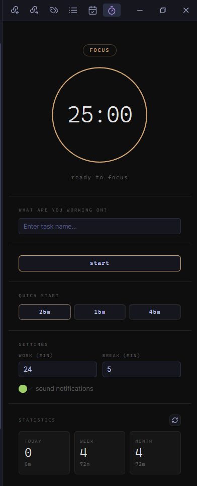

# Pomodoro Logger for Obsidian

A beautiful Pomodoro timer plugin with session logging, statistics, and notifications. Track your focus sessions and analyze productivity.

## Features

- 📊 Statistics - today, this week, this month
- 📋 Session log in Markdown table format
- ⏯️ Start/Pause/Resume/Stop controls
- 📝 Task name input with validation
- ⚙️ Configurable work (1-120 min) and break (1-60 min) durations
- 🔔 Visual notifications and optional sound alerts
- 💾 Auto-save timer state - resumes after app restart

## Installation

### From Obsidian (recommended)
1. Open **Settings** → **Community plugins**
2. Disable Safe mode
3. Search for "Pomodoro Logger"
4. Install and enable

### Manual
1. Clone this repo
2. Run `npm install && npm run build`
3. Copy `main.js`, `manifest.json`, and `styles.css` to your vault's `.obsidian/plugins/obsidian-pomodoro-logger/` folder

## Usage

1. Click the timer icon in the sidebar or run "Open Pomodoro Timer" command
2. Enter a task name
3. Click **start** to begin focusing
4. Take breaks when the timer completes
5. View your statistics and session history

## Session Log

Sessions are saved to `pomodoro-log.md` in your vault root:

| Date | Start Time | Duration (min) | Task | Status |
|------|------------|----------------|------|--------|
| 2024-01-15 | 09:00:00 | 25 | Writing | completed |
| 2024-01-15 | 09:30:00 | 5 | Break | completed |

## License

MIT
